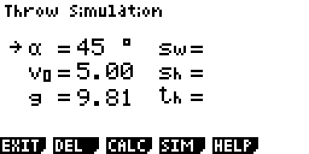
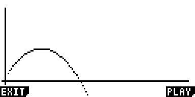

# casio_throw_simulation 
simulate throwing objects
 
 

## Main menu

EXIT [F1] does nothing                                                                 
DEL  [F2] deletes calculated values and sets alpha, startvelocity, g to default        
CALC [F3] calculates sw, sh, th with the given values                                  
SIM  [F4] displays a graph with the throw curve                                        
HELP [F5] displays a help page with the content of this README                         

 

## Simulation [F4]

EXIT [F1] return to main menu                                                          
PLAY [F6] simulates a thrown ball                                                      
